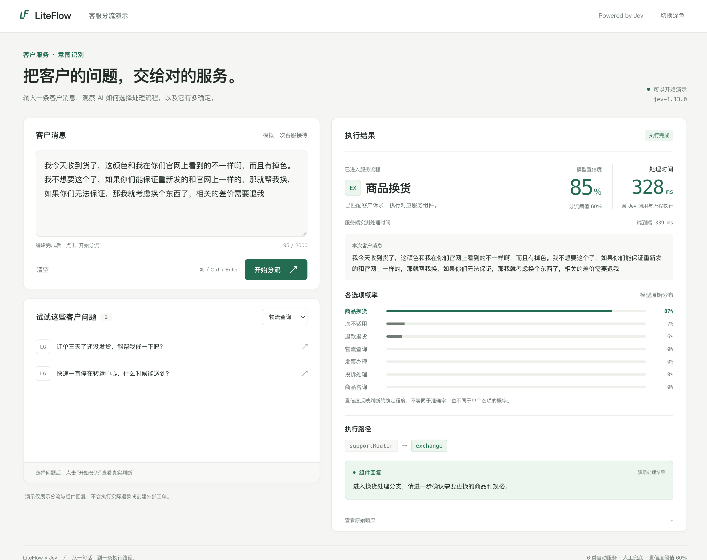
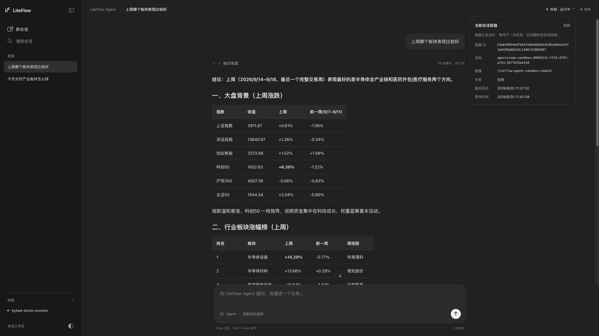

# LiteFlow v2.16.2 发布：Jev 智能分流、Agent 沙箱与会话持久化

LiteFlow 2.16.2 发布了。

从 2.16.0 开始，你就可以把 Agent 当成一个组件，和现有的 Java 业务放在同一条流程里。

这一版主要新增两大特性：

1.新增了 Jev 智能选择组件，让流程能根据用户的意思选择业务分支。

2.Agent 底层升级到 AgentScope 2，增加了 Docker 沙箱，并完善了会话保存、文件管理和多 Agent 协作。

从 2.16.2 开始，原来的 `liteflow-react-agent` 模块全面升级为 `liteflow-agent`。正在使用 `liteflow-react-agent-*` 相关模块的用户，需要切换到对应的 `liteflow-agent-*` 模块，才能使用这一版的 Agent 能力。

下面用两个例子说清楚：给客服系统加一个智能分流入口，以及做一个能连续修改文件的报表助手。

## Jev：毫秒级决策

用户对客服说：

> 暂时先不退了，能不能换一件大一号的？

这句话里既有“退”，也有“换”，当前诉求是换货。靠关键词分流，很容易在这样的表达上出错。

[Jev](https://docs.typesafe.ai/introduction) 是 TypeSafe 提供的决策模型。给它用户输入、判断要求和几个候选项，它会返回选择结果、各选项概率和置信度。LiteFlow 这次接入了它的 Choice 能力，用来选择流程分支。

Jev 做这类判断的优势是快。根据 TypeSafe 在 2026 年 9 月 15 日发布的[官方数据](https://typesafe.ai/blog/introducing-system-one-models-and-jev)，Jev 的端到端响应时间约为 70～500 毫秒，在适合它的结构化决策任务上，速度可达传统大模型的 40～200 倍。它直接并行输出决策和概率，省去了逐个生成文本 token 的过程。用在客服分流入口，可以减少判断环节的等待，让请求更快进入退款、换货或咨询分支。

这组速度对比针对需要输出结构化决策和概率的任务。官方测试通常从美国西海岸发起，实际接入耗时还会受输入长度、网络和服务入口影响。

在已有的 Spring Boot＋LiteFlow 项目里，加入 `com.yomahub:liteflow-agent-jev:2.16.2`，将 LiteFlow 各模块版本统一为 `2.16.2`，再配置 API Key：

```properties
liteflow.rule-source=flow.el.xml
liteflow.agent.jev.provider=typesafe
liteflow.agent.jev.api-key=${JEV_API_KEY}
liteflow.agent.jev.min-confidence=0.6
```

上述配置使用默认的 TypeSafe 入口，`JEV_API_KEY` 从 [TypeSafe 控制台](https://console.typesafe.ai/)获取。也可以设置 `liteflow.agent.jev.provider=openrouter`，并将 `JEV_API_KEY` 换为 OpenRouter 的凭据；省略地址与模型时会自动使用该入口的默认值。选择组件只需要写三个方法：

```java
import com.yomahub.liteflow.agent.jev.JevSwitchComponent;
import com.yomahub.liteflow.annotation.LiteflowComponent;
import java.util.Map;

@LiteflowComponent("supportRouter")
public class SupportRouter extends JevSwitchComponent {
    @Override
    protected Object state() {
        return getRequestData(); // 本次用户输入
    }

    @Override
    protected String instructions() {
        return "按客户当前诉求分流，注意否定和意图变化。无法确定时选择均不适用。";
    }

    @Override
    protected Map<String, String> choices() {
        return Map.of(
            "refund", "明确要求退货退款，且没有撤回退款诉求",
            "exchange", "希望更换商品、尺寸或颜色",
            "consult", "咨询商品或售后规则，尚未要求退款或换货"
        );
    }
}
```

`state()` 提供用户说了什么，`instructions()` 说明怎么判断，`choices()` 列出可以走哪些分支。

假设退款、换货、咨询和人工处理组件已经注册，在 `src/main/resources/flow.el.xml` 中写：

```xml
<flow>
    <chain name="support">
        SWITCH(supportRouter).to(refund, exchange, consult).DEFAULT(manual);
    </chain>
</flow>
```

业务代码照常调用：

```java
LiteflowResponse response = flowExecutor.execute2Resp(
    "support", "暂时先不退了，能不能换一件大一号的？");
```

Jev 选择 `exchange` 且置信度达到阈值后，LiteFlow 就执行换货组件。没有合适选项，或者置信度低于上面设置的 `0.6`，则走 `manual`。接口超时等调用错误仍交给流程的异常处理。

这些分支可以是已有的 Java 组件，也可以是 Agent 或子流程。比如先由 Jev 判断问题属于物流还是售后，再交给不同的 Agent 处理。退款资格、金额和权限，继续由对应业务代码校验。

只做分流时，引入 Jev 模块即可，无需准备 Docker、会话存储或其他聊天模型。你可以拿现有工单试一批，观察结果，再调整选项描述和阈值。完整接入见官网 [Jev 使用文档](https://liteflow.cc/pages/agent-jev-switch/)。

## Agent 在沙箱里读文件、跑脚本、生成报表

再看报表助手。用户把销售明细放进工作区，然后提出要求：

> 按地区汇总销售额，生成一份 CSV，再说明一下哪些地区变化比较大。

Agent 要读取数据、运行统计脚本、检查结果，最后交付文件。2.16.2 增加的 Docker 沙箱，就是这些命令的运行环境。

你把 Python、Node.js 和业务脚本需要的依赖装进镜像，Agent 在容器中操作文件、执行命令。框架负责创建和回收容器，也支持同一会话复用容器，空闲后再回收。容器默认断网，CPU、内存和网络都可以配置；模型请求、Java 工具仍由 Java 应用调用。

比如使用默认 JSON 存储时，准备好镜像、为 Agent 开启命令工具，再加上这三项配置：

```properties
liteflow.agent.harness.filesystem-backend=DOCKER
liteflow.agent.harness.docker.image=liteflow-agent-sandbox:node22
liteflow.agent.harness.docker.snapshot-root=./data/agent-snapshots
```

这个镜像可以用 LiteFlow 源码中的 `liteflow-agent/docker/sandbox/build.sh` 构建，具体步骤见 [Docker 沙箱文档](https://liteflow.cc/pages/agent-docker/)。快照保存的是工作区文件，容器回收后可以恢复；脚本依赖应提前装进镜像，运行中的进程不会随快照恢复。

已有的 Skills 和工具能力也可以配合使用。把统计口径写进 Skill，附上清洗脚本和报告模板，Agent 就能按说明处理数据。以后报表格式变了，改模板；退单统计方式变了，改技能说明。查询订单、库存等操作，则可以继续调用封装好的 Java 工具，或通过 MCP 接入工具服务。

## 文件和对话都保存，下次接着改

报表生成后，用户往往还会补一句：

> 把华东地区单独列出来，再导出一份。

这时 Agent 需要知道上一轮做了什么，也需要拿到刚才生成的文件。2.16.2 将续聊状态、聊天历史和工作区数据纳入会话存储，提供 JSON、Redis、MySQL 三种选择。

本地试用可以先用默认 JSON 存储。已有 Redis 或 MySQL 的项目，可以接入对应存储模块。数据存在哪里、脚本在哪里执行，分开配置：本地执行和 Docker 都能搭配这三种存储。

调用时，后续请求带上同一个会话 ID 就能接着聊。以你已经配置好的 `reportChain` 为例：

```java
LiteflowResponse response = flowExecutor.execute2Resp(
    "reportChain",
    "把华东地区单独列出来，再导出一份 CSV",
    ExecuteOption.of().conversationId(conversationId));
```

这里的 `conversationId` 来自上一轮返回的 `response.getConversationId()`。应用名、Agent 标识、会话 ID 和存储保持一致，正常保存的数据就能在应用重启后继续使用。

用 JSON＋Docker 时，需要保留状态目录和前面的快照目录；改用 Redis 或 MySQL 后，快照由对应后端保存，要移除本地 `snapshot-root` 配置。

聊得久了，模型上下文还会自动压缩，给后续任务留出空间。页面展示的聊天历史单独保存，用户仍能翻看之前的消息。常用的统计口径、用户偏好，也可以按需开启长期记忆提取。

## 多个 Agent 分工，关键操作交给人确认

报表任务增加复核步骤后，可以让分析 Agent 写出结果，再让复核 Agent 检查，最后由 Java 组件保存。注册好这些组件，流程仍然是熟悉的 EL：

```text
THEN(prepareData, analysisAgent, reviewAgent, saveReport);
```

这里的分工由你确定。Agent 之间可以通过同一会话的工作区文件交接，例如分析 Agent 写一份分析稿，复核 Agent 读取后检查。多个 Agent 各自保留对话上下文；同一会话共享工作区，调用会受会话锁协调。

如果任务的拆分方式事先不确定，也可以使用这一版新增的子代理：你声明各个子代理的职责，主 Agent 根据任务决定何时分派。例如写报告时，临时把资料核查交给另一个 Agent，再拿回核查结果。当前子代理需要 Docker 或自定义后端支持。独立部署、提供 A2A 协议的 Agent，也可以接入 LiteFlow 流程。

涉及退款等关键操作时，可以在工具执行前加人工确认。Agent 先查询订单、整理建议，准备调用退款工具时，把工具名和参数交给应用；用户批准后才执行。业务系统需要配置确认规则，并接上自己的审批页面和处理器。

后续 Java 组件要用到订单号、处理建议等字段，还可以声明结构化输出，直接接收 Java 对象或符合 JSON Schema 的数据，省去从回复文字里提取字段的步骤。

## 下载示例，先试一个自己的任务

配套的 LiteFlow Agent 示例项目（在官网 Ai Agent 文档里也可以找到）已经准备好了前后端。Jev 分流和 Agent 聊天都有独立示例，使用 JDK 17 和 Maven 即可开始。

Jev 客服示例支持退款、换货、物流、发票、投诉、咨询六类分流，还能查看置信度、候选概率和实际执行路径：



先获取项目：

```bash
git clone https://github.com/bryan31/liteflow-agent-example.git
cd liteflow-agent-example
```

在仓库根目录运行 Jev 示例：

```bash
export JEV_API_KEY='填写你的 Jev API Key'
mvn -pl liteflow-agent-jev-switch -am clean package -DskipTests
mvn -pl liteflow-agent-jev-switch spring-boot:run
```

打开 [http://localhost:8906](http://localhost:8906)，输入你们客服实际收到过的问题，看看会走哪个分支。页面还可以切换到自由决策，自己填写问题和候选项。

想体验文件处理和连续对话，可以运行本地 JSON 版聊天示例，无需数据库或 Docker：

```bash
export DEEPSEEK_API_KEY='填写你的 DeepSeek API Key'
mvn -pl liteflow-agent-web-local-json spring-boot:run
```

打开 [http://localhost:8905](http://localhost:8905)，就能看到流式回答、工具调用过程、历史会话和附件下载。需要执行脚本时，本机应准备好对应的 Python、Node.js 及依赖。

下面是同一套聊天页面使用 Docker＋MySQL 的运行画面，右上角可以查看会话的容器状态：



聊天示例提供本地／Docker 执行与 JSON／Redis／MySQL 存储的六种组合。运行步骤见[示例文档](https://liteflow.cc/pages/agent-example/)；要接进自己的 Spring Boot 项目，可以从[快速开始](https://liteflow.cc/pages/agent-dependency/)看最小 Agent 组件。

已有 Agent 项目升级时，先将 Maven 中的 `liteflow-react-agent-*` 依赖替换为对应的 `liteflow-agent-*`，版本统一使用 `2.16.2`。这次全面升级还涉及组件 API、存储配置和流式事件协议，需要按新版用法同步调整，组件基类改为 `HarnessAgentComponent`。旧会话和文件不会自动迁移。Agent 模块要求 JDK 17 及以上，具体步骤见 [2.16.2 升级说明](https://liteflow.cc/pages/agent-upgrade-2-16-2/)。

第一次试聊天示例，可以直接输入：“生成一份示例销售数据 CSV，包含商品、数量和金额，并交付文件。”拿到文件后，再让它“按商品汇总，导出另一份”。重启应用，回到原来的会话继续修改，就能看到会话和文件保存的作用。

## LiteFlow-Helper 1.2.1 也已上架

配套的 IDEA 插件 [LiteFlow-Helper 1.2.1](https://plugins.jetbrains.com/plugin/27740-liteflow-helper)已经上架 JetBrains 插件市场，支持识别 Agent 组件和 Jev 组件。

现在，这两类组件可以出现在组件列表和代码补全中，也能从 EL 跳转到对应实现。XML EL 中的 AI 组件使用独立的紫色高亮，组件列表和补全中还有专属 AI 图标，方便看出流程中哪些步骤会调用 AI。

在 IDEA 的插件市场搜索 `LiteFlow-Helper`，安装或更新到 `1.2.1`，就可以配合这一版使用。
